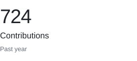
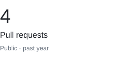
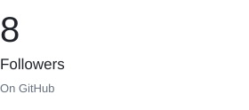

<!-- Generated by scripts/update_profile.py. Edit profile copy in render_readme(). -->
<picture>
  <source media="(prefers-color-scheme: dark)" srcset="./assets/hero-dark.svg">
  
</picture>

**Computer Science · AI Specialization** 
University of Waterloo

I build software around AI, audio, and data — turning experiments into tools people can use.
Currently exploring sound recreation, quantitative research, and AI-assisted workflows.

[Portfolio ↗](https://qiyuancai.vercel.app/) &nbsp; · &nbsp; [All repositories ↗](https://github.com/mobyyyc?tab=repositories)

 

### Selected projects

**[NeuroWave ↗](https://github.com/mobyyyc/NeuroWave)** 
Exploring sound recreation by learning synthesizer parameters from audio. 
Python · PyTorch · Audio synthesis

**[Quantrade ↗](https://github.com/mobyyyc/Quantrade)** 
A local quantitative research platform with reproducible data pipelines and model evaluation. 
Python · Next.js · PostgreSQL

**[PM Agent ↗](https://github.com/mobyyyc/pm-agent)** 
Turning ideas into structured project plans with AI-assisted refinement. 
TypeScript · Next.js · Gemini

 

### By the numbers

<a href="https://github.com/mobyyyc?tab=repositories&amp;sort=stargazers">
<picture>
  <source media="(prefers-color-scheme: dark)" srcset="./assets/stars-dark.svg">
  
</picture>
</a>

<picture>
  <source media="(prefers-color-scheme: dark)" srcset="./assets/metric-contributions-dark.svg">
  
</picture>
<picture>
  <source media="(prefers-color-scheme: dark)" srcset="./assets/metric-prs-dark.svg">
  
</picture>
<picture>
  <source media="(prefers-color-scheme: dark)" srcset="./assets/metric-followers-dark.svg">
  
</picture>

 

### A year of building

<picture>
  <source media="(prefers-color-scheme: dark)" srcset="./assets/contributions-dark.svg">
  
</picture>

 

[Pull Shark](https://github.com/mobyyyc?achievement=pull-shark&amp;tab=achievements) &nbsp; · &nbsp; 
